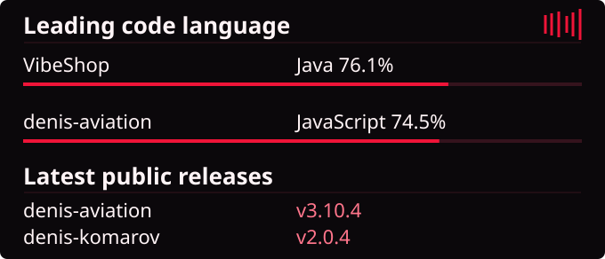

# Denis Komarov
Computer Science student (L-31) at the University of Salerno, focused on Java web development.  
Naples, Italy · **Open to work** — internships, junior roles, and freelance projects.  
[Telegram @dionigi](https://t.me/dionigi) · [Leggi in italiano](./README.it.md)  
I proposed and led [VibeShop](https://github.com/Denis7Kom/website-turbo-layout), a university project for live music and merchandise.

## Featured work

### VibeShop

**Team lead.** I came up with the idea and led the project from start to finish. I divided responsibilities, assigned tasks, and reviewed the work. I worked with Ivan Perruolo and Giulio Alessandro Peluso.

We built a web app for discovering concerts and buying merchandise, with a catalogue, cart, and checkout. **Stack** · Java, JSP, Servlets, DAO, SQL, and MySQL.

[Repository](https://github.com/Denis7Kom/website-turbo-layout) · [Java source](https://github.com/Denis7Kom/website-turbo-layout/tree/main/VibeShop/src/main/java) · [SQL schema](https://github.com/Denis7Kom/website-turbo-layout/blob/main/VibeShop/db/VIBESHOP_FINAL.sql)

**Inside a request** · A Servlet handles the browser request, the DAO queries MySQL, and a JSP page renders the result.

### denis-aviation

An interactive aviation site with a flight network, a flight log, and a local air traffic control demo.

[Open the site](https://denis7kom.github.io/denis-aviation/) · [View the source](https://github.com/Denis7Kom/denis-aviation)

## Security

I’m studying the OWASP Top 10, including SQL injection. In the VibeShop team’s code, you can see a [parameterized query](https://github.com/Denis7Kom/website-turbo-layout/blob/main/VibeShop/src/main/java/model/dao/UserDAO.java) and [filters that check the session and admin role](https://github.com/Denis7Kom/website-turbo-layout/tree/main/VibeShop/src/main/java/filter).

I’ve also explored device security through published work on the Yandex Station and Station Lite. My reading included [miilv’s Yandex Station project](https://github.com/miilv/ya-station-root-shell) and [Ilia Ershov’s Station Lite research](https://github.com/ilia-ershov/yandex-station-lite-research).

My review process is to understand → model → implement → verify → improve.

## Toolkit

- **Used in projects** · Java, JSP, Servlets, SQL, MySQL, HTML, CSS, JavaScript, Git, and GitHub.
- **Learning** · Web application security, OWASP Top 10, and SQL injection.

**Languages, platforms and tools**

  &nbsp;
  &nbsp;
  &nbsp;
  &nbsp;
  &nbsp;
  &nbsp;
  &nbsp;

**Exploring**

  &nbsp;
  &nbsp;
  &nbsp;
  &nbsp;
  &nbsp;
  &nbsp;
  &nbsp;
  &nbsp;

## GitHub activity

  
  

The language card summarizes code in public repositories.

### GitHub Trophy

### GitHub Skyline 3D

[Contribution calendar](https://github.com/Denis7Kom#year-list-container) · [Interactive 3D model](./.github/assets/cinema/skyline.stl) · [GitHub Skyline CLI](https://github.com/github/gh-skyline)

### Project log

Each percentage is a share of the code bytes GitHub detects in that repository. Refreshed weekly.

Languages · [VibeShop](https://api.github.com/repos/Denis7Kom/website-turbo-layout/languages) · [denis-aviation](https://api.github.com/repos/Denis7Kom/denis-aviation/languages)  
Release notes · [denis-aviation](https://github.com/Denis7Kom/denis-aviation/releases/latest) · [denis-komarov](https://github.com/Denis7Kom/denis-komarov/releases/latest)

## Beyond the Code

I also work on photography, drone footage, and books. Aviation is one of my main interests.  
[Explore the portfolio](https://denis7kom.github.io/Denis-Komarov-PH/)

Photography, drone work, books, and aviation artwork

- [Drone and camera portfolio](https://denis7kom.github.io/Denis-Komarov-PH/)
- [Photography on Shutterstock](https://www.shutterstock.com/g/Denis+Komarov%20PH?rid=259170704)
- [Books on Amazon](https://www.amazon.it/stores/Denis-Komarov/author/B0CCSK74QC)

## Connect

Hiring for an internship or junior role, or looking for help with a freelance project? [Message me on Telegram](https://t.me/dionigi) with the role or a short description of the project.

### Quote of the day

